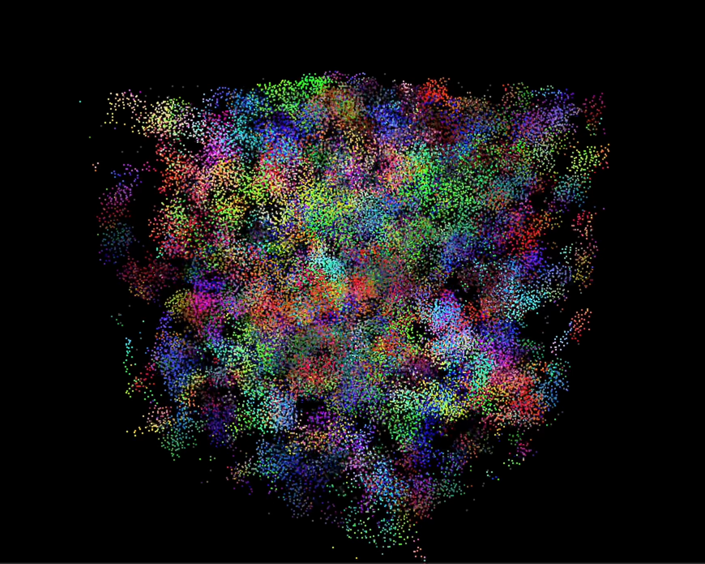
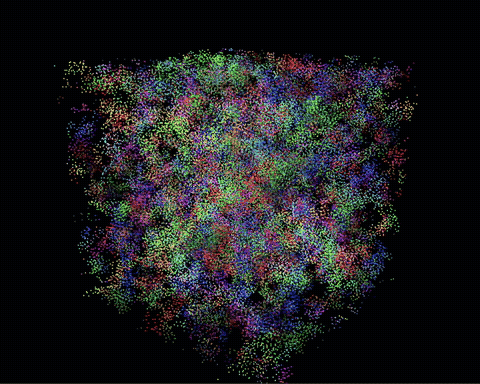
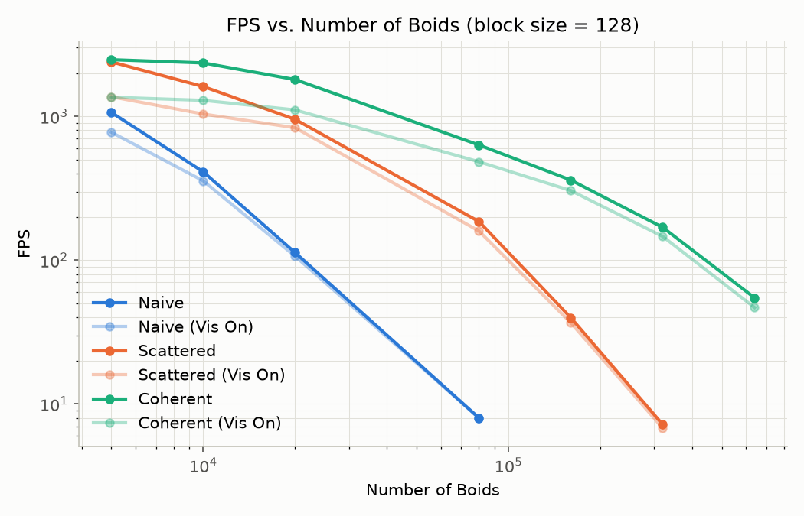
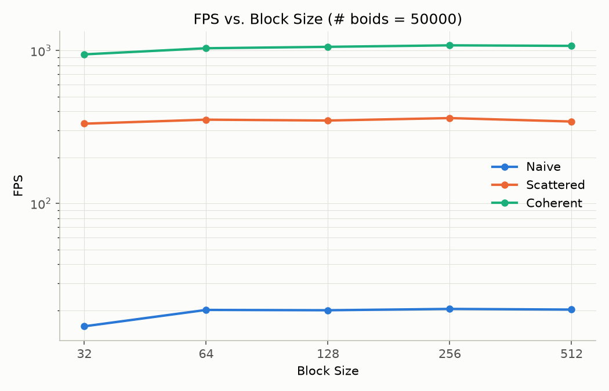

**University of Pennsylvania, CIS 5650: GPU Programming and Architecture,
Project 1 - Flocking**

* Gordon Kim
* Tested on: Windows 11, i7-12700 @ 2.10GHz 32GB, T1000 4GB (CETS Computer)

## Features Implemented

* Part 1: Naive brute-force boid neighbor search
* Part 2.1: Uniform grid neighbor search (scattered)
* Part 2.3: Uniform grid neighbor search (coherent memory access)

## Bug Fixes

* Fixed an off-by-one in `glDrawElements` (`main.cpp`) that drew `N_FOR_VIS + 1` points instead of `N_FOR_VIS`, reading one index past the end of the boid index buffer and crashing the driver when visualization was on at larger boid counts.

## Performance Analysis

Methodology: Release build, V-Sync off, `VISUALIZE 0`. FPS read from `mainLoop` prints to stdout 10 seconds after launch, giving a consistent warm-up period across runs instead of eyeballing the window title.

### FPS vs. Number of Boids

*Constants: block size = 128*

Boid counts: 5000 / 10000 / 20000 / 80000 / 160000 / 320000

| # Boids     | Naive       | Naive (Vis On) | Scattered   | Scattered (Vis On)  | Coherent    | Coherent (Vis On) |
|-------------|-------------|----------------|-------------|---------------------|-------------|--------------------|
| 5000        | 1064.3      | 775.2          | 2391.7      | 1367.4              | 2476.3      | 1357.9             |
| 10000       | 411.2       | 355.9          | 1611.2      | 1037.7              | 2350.9      | 1291.6             |
| 20000       | 112.8       | 106.5          | 952.4       | 832.5               | 1801.7      | 1107.8             |
| 80000       | 8.0         | 8.0            | 185.6       | 159.5               | 632.3       | 483.2              |
| 160000      |             |                | 39.8        | 36.7                | 360.5       | 304.7              |
| 320000      |             |                | 7.2         | 6.8                 | 169.1       | 146.2              |
| 640000      |             |                |             |                     | 54.7        | 46.8               |

#### **Q: How does changing the number of boids affect performance, for each implementation? Why do you think this is?**

As the number of boids increases, FPS decreases for all implementations, with the Naive implementation dropping the fastest, followed by Scattered and then Coherent.
- **Naive:** Only sustains 8.0 FPS at 80,000 boids and drops to extremely low FPS at larger counts. Its performance scales as O(N^2), making it unsustainable due to repeated, redundant reads of the same boids.
- **Scattered:** Has significantly improved performance compared to Naive across all boid counts, but also drops substantially around 320,000 boids on this machine. The new data structure reduces the number of boids that need to be considered as neighbors, avoiding many unnecessary comparisons.
- **Coherent:** Has similar performance to the Scattered implementation at low boid counts (5,000), but becomes increasingly more performant at higher counts, sustaining 54.7 FPS even at 640,000 boids. Sequential memory access allows the device to access memory more efficiently and reduces the number of memory calls required in each step.

Enabling visualization (`VISUALIZE 1`) lowers FPS across all three implementations, since each frame now has to copy boid positions/velocities and render. The relative hit is smallest for Naive and largest for Scattered/Coherent, because Naive is already bottlenecked by the simulation kernel itself, so the visualization cost is a relatively smaller cost. Scattered and Coherent finish their simulation step much faster, so that same fixed visualization cost is proportionally higher. 
- **Code fix:** At larger boid counts with visualization on, an off-by-one in the `glDrawElements` call (`main.cpp`) was reading one index past the end of the boid index buffer and crashing the driver; fixing the element count let all Vis On rows above be measured.

### FPS vs. Block Size

*Constants: # boids = 50000*

| Block Size  | Naive       | Scattered   | Coherent    |
|-------------|-------------|-------------|-------------|
| 32          | 15.7        | 332.5       | 944.7       |
| 64          | 20.1        | 353.2       | 1035.9      |
| 128         | 20.0        | 348.6       | 1058.2      |
| 256         | 20.4        | 361.7       | 1082.4      |
| 512         | 20.2        | 343.4       | 1073.6      |

#### **Q: How does changing the block count/block size affect performance, for each implementation? Why do you think this is?**

Block size had little observable effect on FPS for any implementation, aside from the initial dip at block size 32. Once block size reaches 64 and above, performance is roughly flat across all three implementations. This is likely because the bottleneck is not due to the block size. I'm not certain what performance improvement was expected from varying block size here.

### Coherent vs. Scattered Grid

*Constants: block size = 128*

| # Boids     | Naive       | Scattered   | Coherent    |
|-------------|-------------|-------------|-------------|
| 20000       | 112.8       | 952.4       | 1801.7      |
| 320000      |             | 7.2         | 169.1       |

#### **Q: Did you experience any performance improvements with the more coherent uniform grid? Was this the outcome you expected? Why or why not?**

Yes. At 20,000 boids Coherent is about 1.89x faster than Scattered, and at 320,000 boids Coherent is roughly 23x faster, so neighbor data is scattered across `dev_pos`/`dev_vel1` and each access is a separate memory read. Coherent removes that indirection by physically reordering `pos`/`vel1` into cell-contiguous buffers ahead of time, so neighbor lookups become sequential memory reads that the GPU can process more effectively and the performance increase is visible when we significantly increase the boid count.

### Cell Width: 8 vs. 27 Neighboring Cells

*Constants: # boids = 50000, block size = 128*

| Config      | Naive       | Scattered   | Coherent    |
|-------------|-------------|-------------|-------------|
| 8-cell      | 20.0        | 348.6       | 1058.2      |
| 27-cell     | 20.1        | 376.3       | 1345.9      |

#### **Q: Did changing cell width and checking 27 vs 8 neighboring cells affect performance? Why or why not?**

Yes, the 27-cell configuration was faster for Scattered and Coherent implementations. This is because reducing the cell width makes each cell's bounding box tighter relative to the fixed search radius. With 8-cell, each cell is 2x the search radius, so the worst case becomes `4 * maxDistance` per side. With 27-cell, each cell is the search radius, so the worst case becomes `3 * maxDistance` per side. So the 27-cell grid potentially wastes less time on invalid boids.
